# Биржа

### Описание задания
Требовалось разработать **RESTfull API service** — биржу для проведения торгов криптовалютами.

Из дополнительных заданий было выполнено подключение к базе данных `PostgreSQL` для хранения данных о балансе пользовательских кошельков и истории операций.

### Описание работы приложения
Приложение написано с помощью `Spring` контейнеров. Базовые запросы принимаются в формате `json` и в этом же формате сервис возвращает данные. Классы с именем **DAO** играют роль sql-запросника. 

### REST-запросы, реализованные в приложении
Для удобства **REST-запросы** отправлялись в приложении **Postman**
* Регистрация нового пользователя.  

    POST запрос
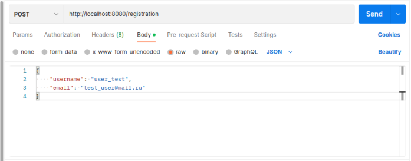

      Ответ
      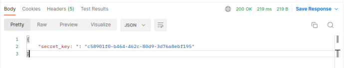

    Запрос с уже существующим пользователем
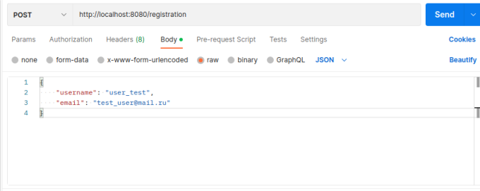

      Ответ
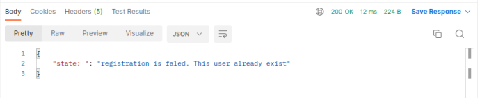

* Просмотр баланса своего кошелька.

    GET запрос
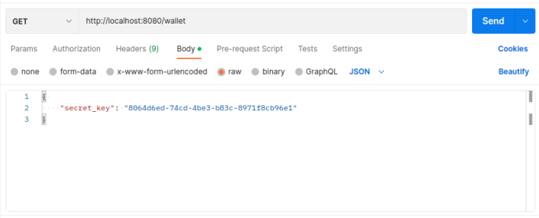!

      Ответ
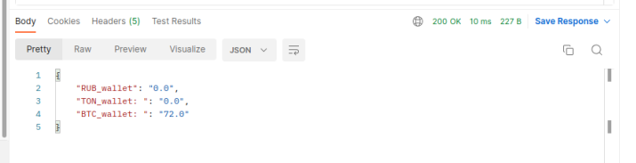

* Пополнение кошелька.
    

    POST запрос
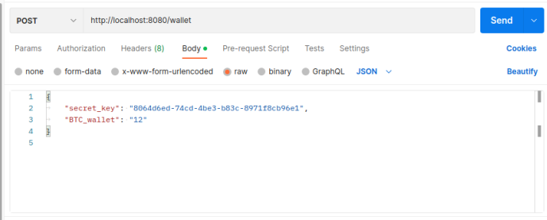

    Ответ
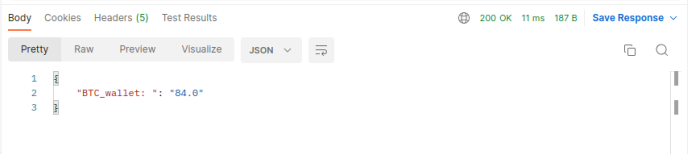

* Посмотреть общую сумму на всех пользовательских счетах для указанной валюты (от имени админа).

    GET запрос 
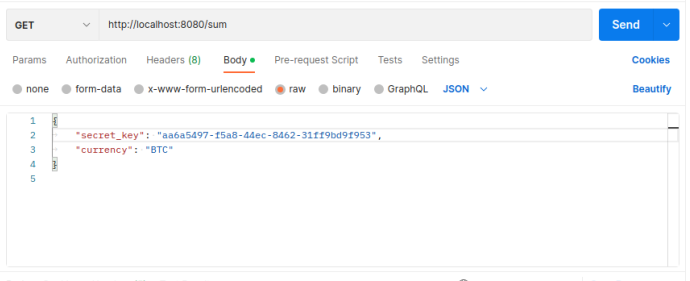
    
    Ответ
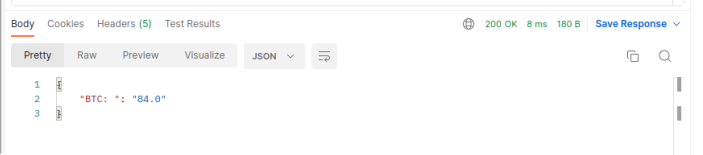

* Посмотреть общую сумму на всех пользовательских счетах для указанной валюты (от имени пользователя).

    GET запрос 
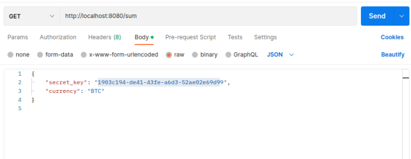
    
    Ответ
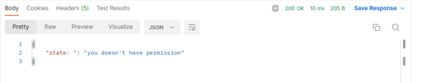

* Вывод денег с биржи.

    POST запрос
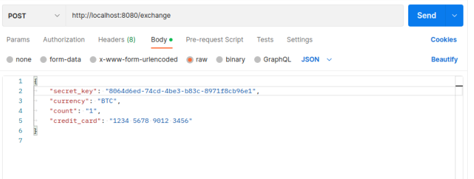
    
    Ответ
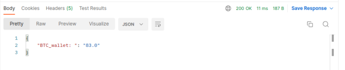

* Просмотр актуальных курсов валют (данный запрос будет доступен и пользователю и администратору).

    GET запрос
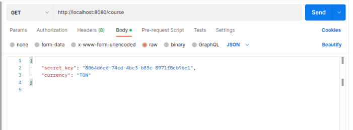

    Ответ
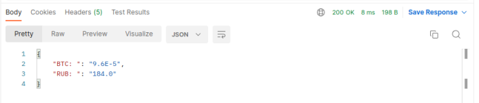

* Изменить курс валют.

    POST запрос
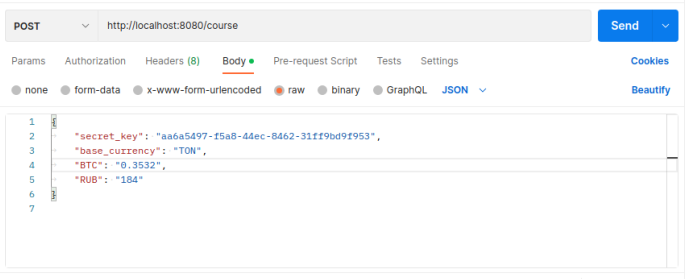
    
    Ответ
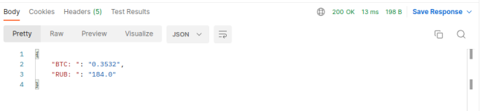
